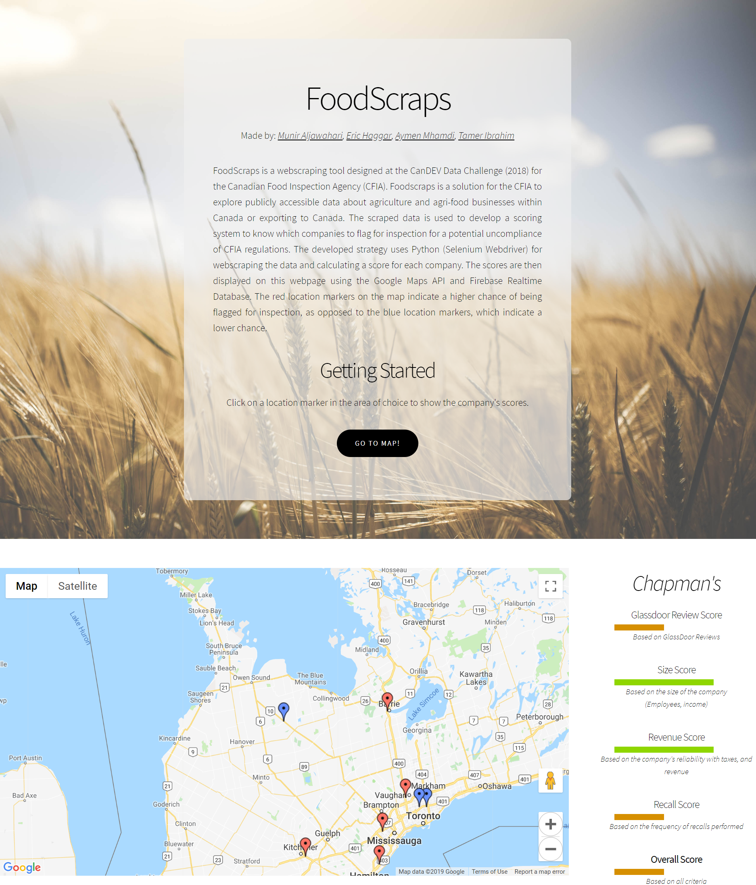

# FoodScraps

FoodScraps is a webscraping tool designed at the CanDEV Data Challenge (2018) for the Canadian Food Inspection Agency (CFIA). Foodscraps is a solution for the CFIA to explore publicly accessible data about agriculture and agri-food businesses within Canada or exporting to Canada. The scraped data is used to develop a scoring system to know which companies to flag for inspection for a potential uncompliance of CFIA regulations. The developed strategy uses **Python (Selenium Webdriver)** for webscraping the data and coming up with a score for each company. The scores are then displayed on an interactive webpage using the **Google Maps API** and **Firebase Realtime Database**. The red location markers on the map indicate a higher chance of being flagged for inspection, as opposed to the blue location markers, which indicate a lower chance.



## Table Of Contents


- [Getting Started](#getting-started)
  * [Webscraping Instructions](#webscraping-instructions)
  * [Website Instructions](#website-instructions)
- [Contact Us](#contact-us)

## Getting Started 

clone the repository

```
git clone https://github.com/EricHaggar/FoodScraps.git
```

change to the project directory

```
cd FoodScraps
```

### Webscraping Instructions

Navigate to the scripts directory

```
cd scripts
```

If Python is not installed on your machine, install it before proceeding

```
https://www.python.org/downloads/
```

If it is installed, ensure the Python version being used is 3.7.0 or higher

```
python --version
```
Then install all dependencies for webscraping and Firebase using pip

```
pip install selenium
```
```
pip install chromedriver
```
```
pip install google
```
```
pip install pyrebase
```

Create a free Firebase account and create an empty realtime database with read and write permissions

```
https://firebase.google.com/
```

Navigate to `master.py` and add your Firebase database information in `config` 

```
# Add firebase database information here!

config = {

    "apiKey": "",
    "authDomain": "",
    "databaseURL": "",
    "projectId": "",
    "storageBucket": ""
}

firebase = pyrebase.initialize_app(config)
database = firebase.database()
```

The scripts are ready to be run in the background!

```
python master.py
```

### Website Instructions

From the main project directory, navigate to the website directory

```
cd website
```
Navigate to `index.html` and add your [Google Maps API Key](https://developers.google.com/maps/documentation/javascript/get-api-key) 

```
<script async defer src="https://maps.googleapis.com/maps/api/js?key=YOUR_API_KEY&callback=initMap"></script>
```

In the same file, add your firebase database connection information to `config`

```
//Add Firebase database information here!

config = {
        apiKey: "",
	authDomain: "",
	databaseURL: "",
	projectId: "",
	storageBucket: "",
	messagingSenderId: ""
}

firebase.initializeApp(config);
```

The website can now be run from within the `website` directory

```
start index.html
```

## Contact Us

For more information, send us an email at <candevteam@gmail.com>.


